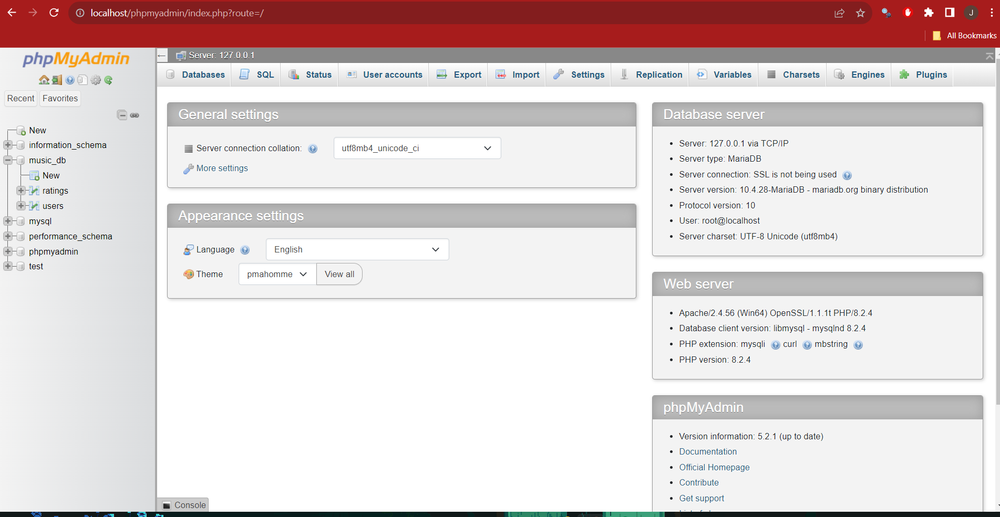
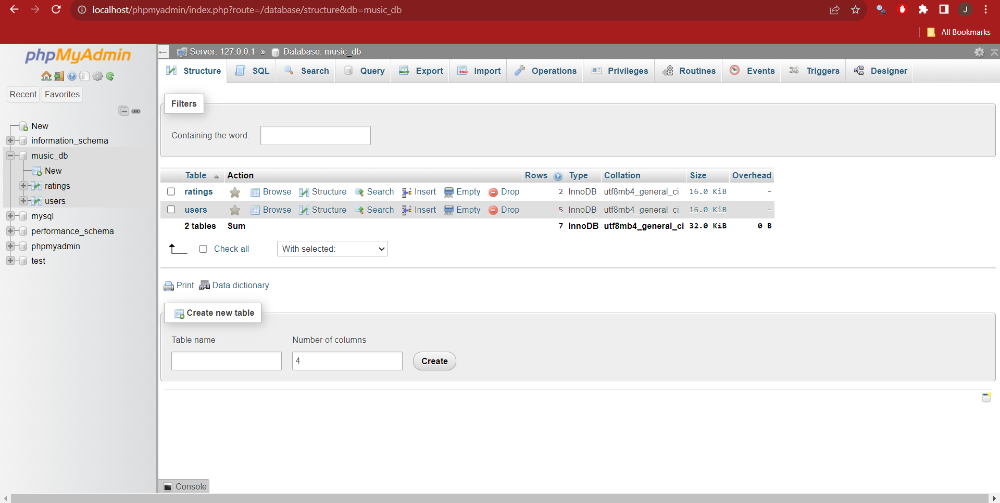
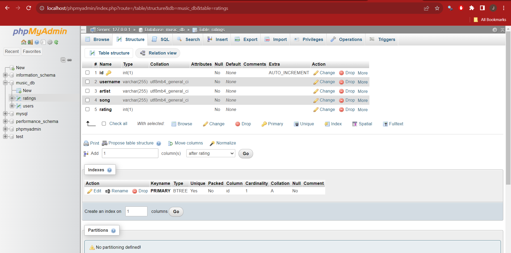
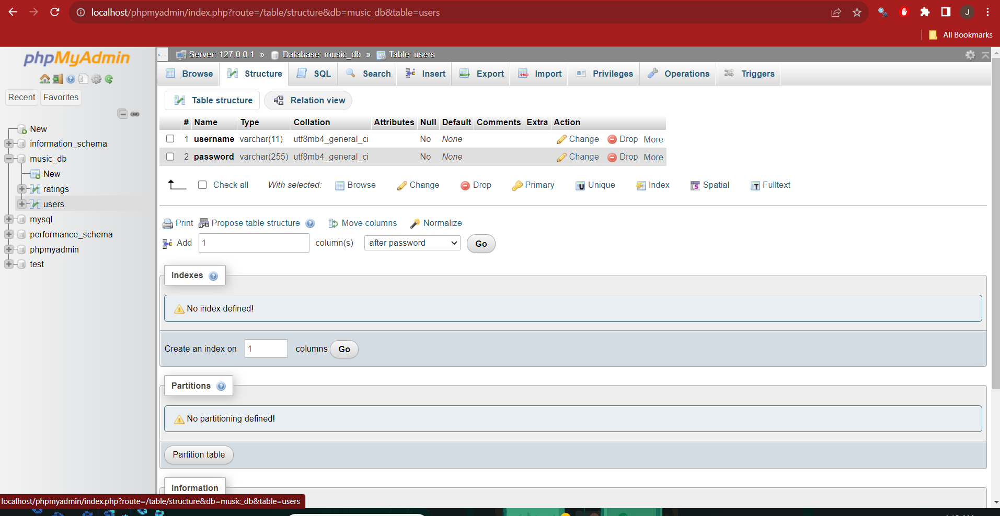

# Musical-Ranks-React-js-WebApp

**PLEASE MAKE NOTE: depending on how you clone the repository this may affect how things run, specifically with the axios requests. Instances of this are seen most obviously in the Home.js file. Right now the path is set to a specific folder name, but this may vary. Ensure when testing that the path is correct.**

MusicalRanks is a web application that allows users to share their musical tastes and thoughts. Listeners from across the platform can not only rank their personal tastes of music, but they can upvote/downvote the rankings of their fellow users!

# What is our goal?

Our goal for this homework assignment is to design and implement a single page app with a JavaScript/React frontend. For this homework we are also using the Model-view-controller(MVC) design pattern to create a state transfer API that connects the front
and back-end of our app. Our app still has the main features that it prides itself in. You are able to Sign Up, Login, and Log out. You can also create rankings for your favorite songs, delete your ratings, view song ratings, and update ratings.

# How can I test this for myself?

In order to set up and run the app you should start by installing and running the app XAMPP and running MySQL and Apache by clicking "Start" in the XAMPP Control Panel. You should clone the github repository into the htdocs folder inside of XAMPP. Open a terminal and make your way into the folder containing the app. Ensure that you have node.js installed. Now cd into the my-app folder and in here is where we have to download all our dependencies. You should download the following:

- npm i react-modal
- npm i bootstrap
- npm i react-router-dom
- npm i react-axios
- npm i react-bootstrap
- npm i --save @fortawesome/fontawesome-svg-core
- npm i --save @fortawesome/free-solid-svg-icons
- npm i --save @fortawesome/free-regular-svg-icons
- npm i @fortawesome/react-fontawesome
- npm i react-toastify

Now you should be able run the app, but we also have to set up our local databases. Type "localhost/myphpadmin" into your browser and create two tables named ratings and users under the database name music_db. You can follow the pictures attached below to make your two databases. If the pictures are not loading in the ReadME file, they are in the folder titled read.me-pics.

# MVC Architecture

For our MVC design, we have our Model, View and Controller files. Our models handle the logic of data that's received from given requests. Our controller calls upon functions in the model and processes the server response. Our View then takes the data from the server response and uses them to display it in the front end.

# Libraries and Resources

Below are the links to any libraries or resources that were used for this homework assignment.

- https://www.npmjs.com/package/@fortawesome/fontawesome-svg-core
- https://www.npmjs.com/package/@fortawesome/free-solid-svg-icons
- https://www.npmjs.com/package/@fortawesome/free-regular-svg-icons

# Additional Functionality

For additional functionality we've implemented react notifications using toastify. Whenever a user takes any sort of action like logging in, logging out, or anything related to songs they get a nice notification notififying them of their success or failure.

Work distribution: 50/50

